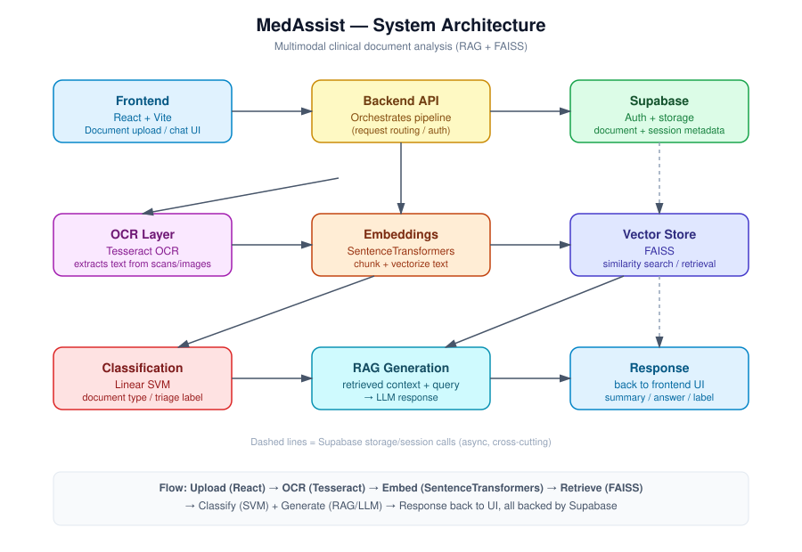
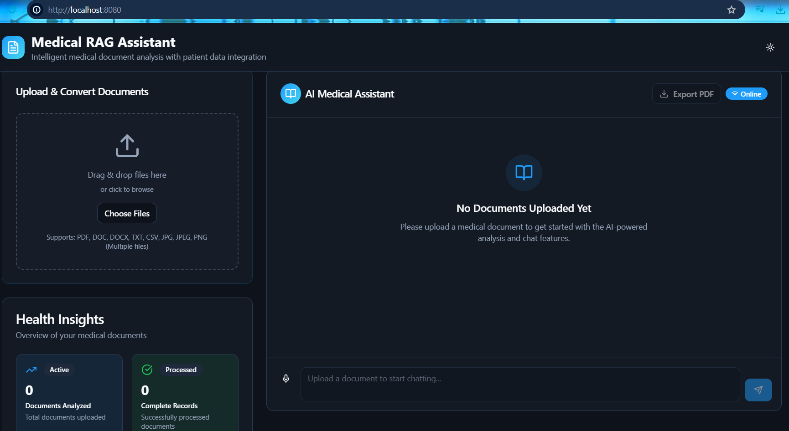
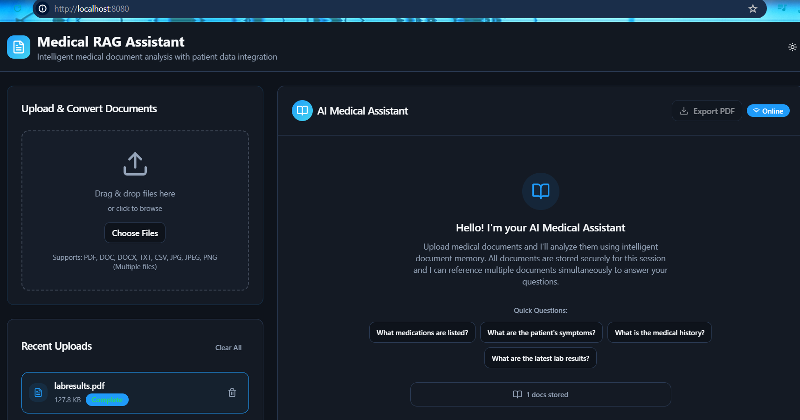
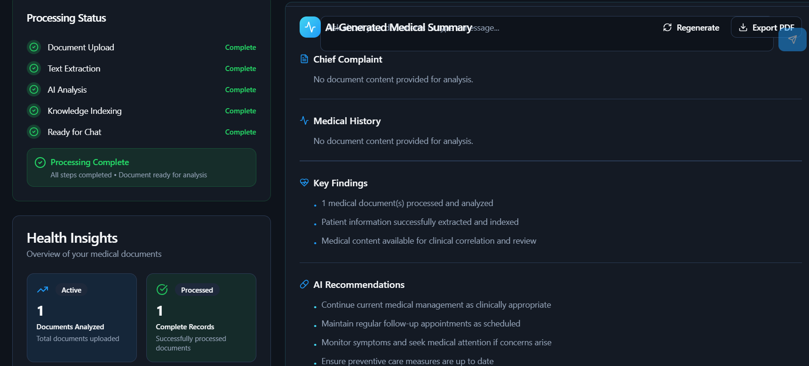
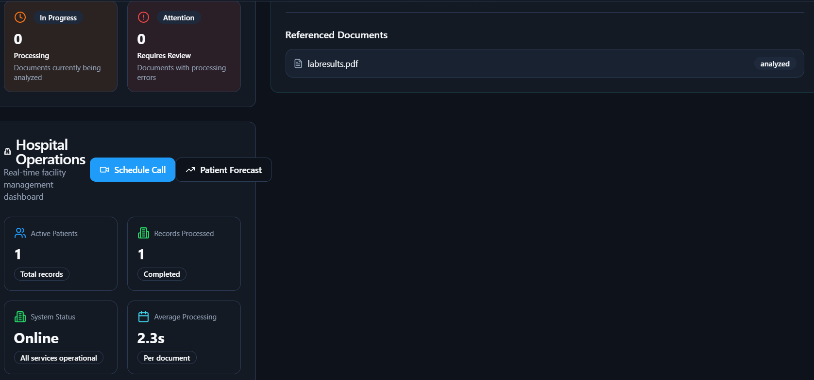
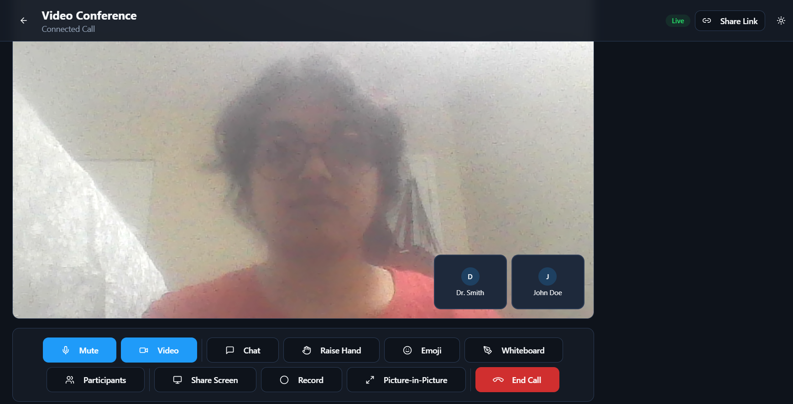
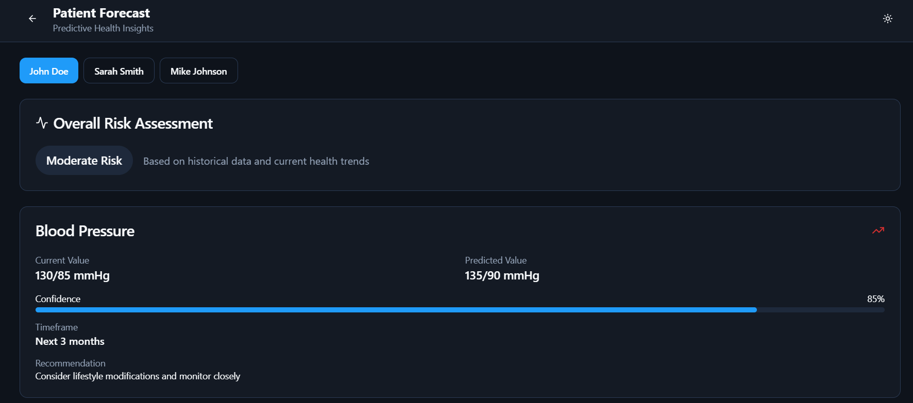

# MedAssist: Multimodal Clinical AI Assistant

**Author**: Raghav Krishnamurthy, Shruthi Ravi

**Data**: Patients Prescriptions in different file formats (View the Data folder)

**Framework**: Retrieval Augmented Generation (RAG) and Natural Language Processing (NLP)

**Objective**: A software that has an ability to understand and give a summarized report of a patient's health history through their previous appointments, prescriptions, lab results and other medical formalities while interacting with both patients and doctors to provide a better health care support.  

MedAssist is developed via Retrieval Augmented Generation concept following through data with an ability to interact using Natural Language Processing with the doctors and patients. It is an application that helps doctors quickly understand a patient's medical history. Doctors can upload prescriptions, lab reports, and clinical notes as PDFs, scanned images, text files, or tables. Perfectly analyzes the full set of documents to generate a patient summary, surface a preliminary diagnosis suggestion through an interactive chatbot, and let doctors schedule a video call appointment directly with the patient.

## What It Does

- **Multimodal document ingestion**: Upload prescriptions and reports as PDF, text, scanned image, or table formats (any formated data available in the hospital database of that particular patient)
- **Automated patient summarization**: Parses and synthesizes multi-source clinical documents into a single, readable patient summary
- **AI diagnostic assistant**: An interactive chatbot answers questions about the patient's condition and surfaces a preliminary diagnosis based on retrieved context
- **Doctor-patient video consultation**: Doctors can initiate a video call appointment with the patient directly from the application

> **Disclaimer**: MedAssist is a portfolio/research project and is not a certified medical device. Diagnostic suggestions are intended to support, not replace, clinical judgment.

## How It Works

MedAssist follows a Retrieval-Augmented Generation (RAG) pipeline purpose-built for multimodal clinical data:

1. **Ingestion & OCR**: Prescriptions, scanned reports, and documents are parsed using OCR (Tesseract) and document parsers (pdfplumber, docx) to extract raw text from PDFs, images, and tables
2. **Preprocessing**: Extracted text is cleaned and normalized using Regex-based pattern extraction to standardize clinical notes and diagnostic descriptions
3. **Embedding**: Cleaned text is converted into dense semantic vectors using `SentenceTransformers (all-MiniLM-L6-v2)`
4. **Retrieval**: FAISS performs fast nearest-neighbor search over the embedded patient records to retrieve the most relevant context for a query
5. **Classification**: A Linear SVM (scikit-learn) classifies retrieved content to support diagnostic categorization
6. **Generation**: Retrieved context is passed to the chatbot layer to generate the patient summary and diagnostic response

## Architecture


## Tech Stack

| Category | Tools |
|---|---|
| Language | Python |
| Data handling | Pandas, NumPy |
| Text preprocessing | Regex (re), PDF/Text/Document parsers (pdfplumber, docx), OCR (Tesseract) |
| Embeddings | SentenceTransformers (all-MiniLM-L6-v2), PyTorch |
| Retrieval | FAISS (Facebook AI Similarity Search) |
| Classification | Scikit-learn (Linear SVM) |
| Visualization | Matplotlib, Seaborn |
| Backend / Database | Supabase |
| Frontend | Vite, TypeScript, React, shadcn-ui, Tailwind CSS |


## Project Structure
```
medassist/
├── Application_Code/
│   ├── public/
│   │   ├── favicon.ico
│   │   ├── placeholder.svg
│   │   └── robots.txt
│   ├── src/
│   │   ├── components/
│   │   │   ├── ui/                      # shadcn/ui primitives (accordion, button, dialog, form, table, etc.)
│   │   │   ├── ChatInterface.tsx
│   │   │   ├── ClinicalWorkflow.tsx
│   │   │   ├── DocumentSearch.tsx
│   │   │   ├── DocumentUpload.tsx
│   │   │   ├── HealthInsights.tsx
│   │   │   ├── HospitalOperations.tsx
│   │   │   ├── LabResults.tsx
│   │   │   ├── MedicalSummary.tsx
│   │   │   ├── MedicalTimeline.tsx
│   │   │   ├── MessagingDialog.tsx
│   │   │   ├── NavLink.tsx
│   │   │   ├── PatientCommunication.tsx
│   │   │   ├── PatientManager.tsx
│   │   │   ├── ProcessingStatus.tsx
│   │   │   ├── QuickActions.tsx
│   │   │   ├── RecentDocuments.tsx
│   │   │   └── ThemeToggle.tsx
│   │   ├── hooks/
│   │   │   ├── use-mobile.tsx
│   │   │   └── use-toast.ts
│   │   ├── integrations/supabase/
│   │   │   ├── client.ts
│   │   │   └── types.ts
│   │   ├── lib/
│   │   │   └── utils.ts
│   │   ├── pages/
│   │   │   ├── AIInsights.tsx
│   │   │   ├── Appointments.tsx
│   │   │   ├── Index.tsx
│   │   │   ├── JoinCall.tsx
│   │   │   ├── LabResultsPage.tsx
│   │   │   ├── Medications.tsx
│   │   │   ├── NotFound.tsx
│   │   │   ├── PatientForecast.tsx
│   │   │   ├── Records.tsx
│   │   │   ├── VideoCall.tsx
│   │   │   └── VitalSigns.tsx
│   │   ├── App.css
│   │   ├── App.tsx
│   │   ├── index.css
│   │   ├── main.tsx
│   │   └── vite-env.d.ts
│   ├── supabase/
│   │   ├── functions/
│   │   │   ├── chat/index.ts
│   │   │   ├── process-document/index.ts
│   │   │   └── transcribe-audio/index.ts
│   │   ├── migrations/                  # 4 SQL migration files
│   │   └── config.toml
│   ├── .env
│   ├── .gitignore
│   ├── README.md
│   ├── package.json
│   ├── tailwind.config.ts
│   ├── vite.config.ts
│   └── (other configs: tsconfig*, eslint, postcss, components.json, lockfiles)
├── Data/
│   ├── clinicalnotes.txt
│   ├── labresults.pdf
│   ├── test-patient-update.txt
│   ├── transcript-1.txt
│   └── transcript-2.txt
└── Final_Deliverables/
    ├── AI_Medical_Assistant.pptx
    ├── Master's Project Report_Med RAG.pdf
    └── medassist_architecture.svg
```

## Setup

```sh
# Clone the repository
git clone <YOUR_GIT_URL>

# Navigate to the project directory
cd rag_med
cd Application_Code

# Install dependencies
npm install

# Start the development server
npm run dev
```

## Outputs
#### a) The Webpage includes the portnumber and general outlook for any user before uploading the documents


#### b) After Uploading the documents, status of each process applied on that particular document can be monitored by the user. To the right side of the page, the user can view the summerized report and an interaction chat box for user's communication with AI assistant 




#### c) Other features for the user to explore through the webpage.


#### d) This module is developed for doctor and patient interactions, for emergency and critical diagnosis.

(Note: We need professional supervision and direction for AI to be used effectively for diagnosing the patients through their medical condition despite AI being the cornerstone of information)



#### f) General Forecasts and medical check reports for each and every patient.


## Results 

Initial model evaluation on a small validation set:

- **Accuracy: 87.5%**
- Strong precision/recall (1.00) on several diagnostic classes; one underrepresented class currently scores 0, highlighting a target area for more training data going forward

*Note: this evaluation set is small (8 samples total). Expanding the labeled dataset is a next step to validate these results at scale.*

## 


